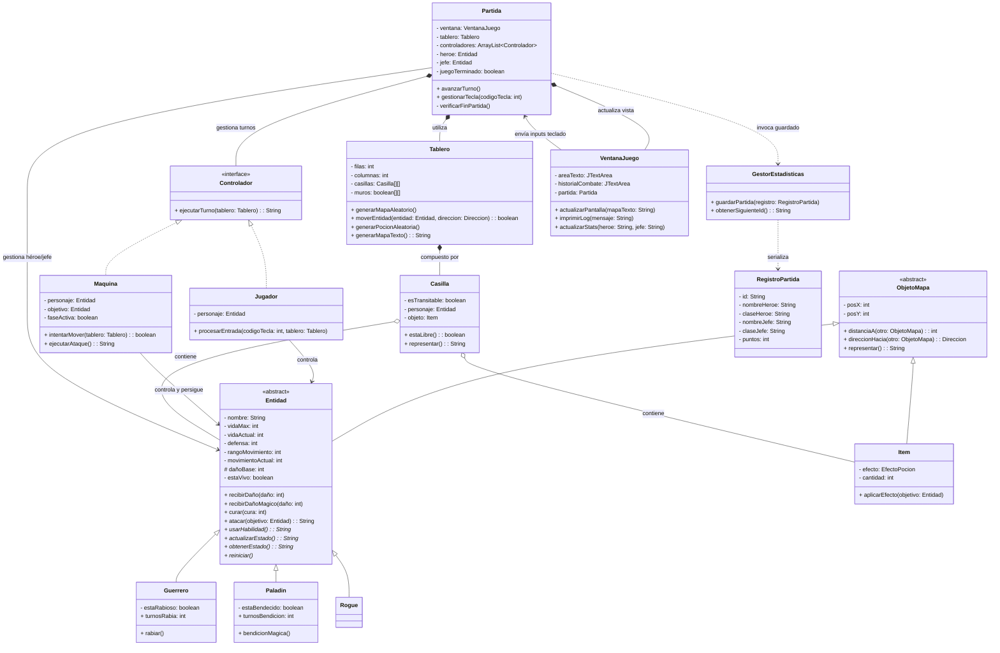

```mermaid
classDiagram
    %% PAQUETE ENTIDADES
    class ObjetoMapa {
        <<abstract>>
        - posX: int
        - posY: int
        + distanciaA(otro: ObjetoMapa): int
        + direccionHacia(otro: ObjetoMapa): Direccion
        + representar(): String
    }

    class Entidad {
        <<abstract>>
        - nombre: String
        - vidaMax: int
        - vidaActual: int
        - defensa: int
        - rangoMovimiento: int
        - movimientoActual: int
        # dañoBase: int
        - estaVivo: boolean
        + recibirDaño(daño: int)
        + recibirDañoMagico(daño: int)
        + curar(cura: int)
        + atacar(objetivo: Entidad): String
        + usarHabilidad(): String*
        + actualizarEstado(): String*
        + obtenerEstado(): String*
        + reiniciar()*
    }

    class Guerrero {
        - estaRabioso: boolean
        + turnosRabia: int
        + rabiar()
    }

    class Paladin {
        - estaBendecido: boolean
        + turnosBendicion: int
        + bendicionMagica()
    }

    class Rogue {
    }

    class Item {
        - efecto: EfectoPocion
        - cantidad: int
        + aplicarEfecto(objetivo: Entidad)
    }

    %% PAQUETE ESCENARIO
    class Casilla {
        - esTransitable: boolean
        - personaje: Entidad
        - objeto: Item
        + estaLibre(): boolean
        + representar(): String
    }

    class Tablero {
        - filas: int
        - columnas: int
        - casillas: Casilla[][]
        - muros: boolean[][]
        + generarMapaAleatorio()
        + moverEntidad(entidad: Entidad, direccion: Direccion): boolean
        + generarPocionAleatoria()
        + generarMapaTexto(): String
    }

    %% PAQUETE CONTROLADORES
    class Controlador {
        <<interface>>
        + ejecutarTurno(tablero: Tablero): String
    }

    class Jugador {
        - personaje: Entidad
        + procesarEntrada(codigoTecla: int, tablero: Tablero)
    }

    class Maquina {
        - personaje: Entidad
        - objetivo: Entidad
        - faseActiva: boolean
        + intentarMover(tablero: Tablero): boolean
        + ejecutarAtaque(): String
    }

    %% PAQUETE DATOS
    class GestorEstadisticas {
        + guardarPartida(registro: RegistroPartida)
        + obtenerSiguienteId(): String
    }

    class RegistroPartida {
        - id: String
        - nombreHeroe: String
        - claseHeroe: String
        - nombreJefe: String
        - claseJefe: String
        - puntos: int
    }

    %% MOTOR PRINCIPAL (MVC)
    class Partida {
        - ventana: VentanaJuego
        - tablero: Tablero
        - controladores: ArrayList~Controlador~
        - heroe: Entidad
        - jefe: Entidad
        - juegoTerminado: boolean
        + avanzarTurno()
        + gestionarTecla(codigoTecla: int)
        - verificarFinPartida()
    }

    class VentanaJuego {
        - areaTexto: JTextArea
        - historialCombate: JTextArea
        - partida: Partida
        + actualizarPantalla(mapaTexto: String)
        + imprimirLog(mensaje: String)
        + actualizarStats(heroe: String, jefe: String)
    }

    %% RELACIONES E INTERACCIONES
    ObjetoMapa <|-- Entidad
    ObjetoMapa <|-- Item
    Entidad <|-- Guerrero
    Entidad <|-- Paladin
    Entidad <|-- Rogue

    Controlador <|.. Jugador
    Controlador <|.. Maquina

    Jugador --> Entidad : controla
    Maquina --> Entidad : controla y persigue

    Casilla o-- Entidad : contiene
    Casilla o-- Item : contiene
    Tablero *-- Casilla : compuesto por

    Partida *-- Tablero : utiliza
    Partida *-- VentanaJuego : actualiza vista
    Partida *-- Controlador : gestiona turnos
    Partida --> Entidad : gestiona héroe/jefe
    VentanaJuego --> Partida : envía inputs teclado

    GestorEstadisticas ..> RegistroPartida : serializa
    Partida ..> GestorEstadisticas : invoca guardado
```